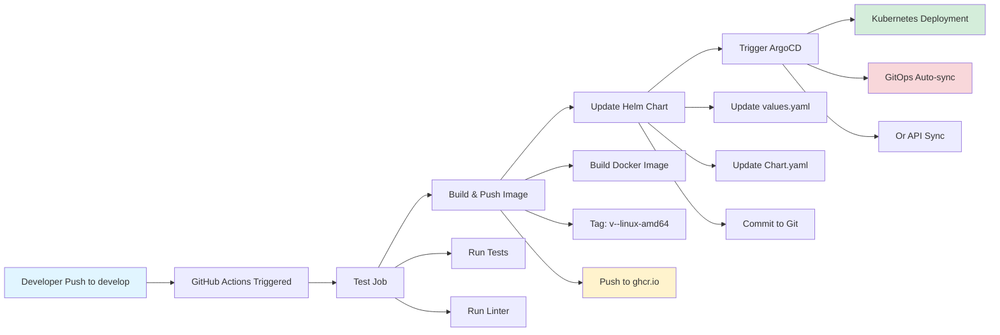

# Telegram Bot Project

## Project Overview
This is a Telegram bot project written in Go language. The bot is designed to handle user messages and respond accordingly using the Telegram Bot API.

## Technical Requirements

### Prerequisites
- Go 1.23.5 or higher
- Git
- Docker (for container builds)
- Kubernetes cluster (for deployment)
- Helm 3.x (for Kubernetes deployment)
- Telegram Bot Token (obtained from BotFather)

### Dependencies
- github.com/spf13/cobra - For CLI command handling
- gopkg.in/telebot.v4 - For Telegram bot functionality

## Project Structure
```
.
├── cmd/
│   └── kbot/
│       └── main.go           # Application entry point
├── internal/
│   └── bot/
│       └── bot.go            # Bot logic and handlers
├── kbot/                     # Helm chart
│   ├── Chart.yaml            # Chart metadata
│   ├── values.yaml           # Default configuration
│   └── templates/
│       ├── _helpers.tpl      # Template helpers (incl. kbot.image)
│       ├── deployment.yaml   # Kubernetes Deployment
│       ├── service.yaml      # Kubernetes Service
│       └── NOTES.txt         # Post-install notes
├── .github/
│   └── workflows/
│       ├── cicd-develop.yml  # CI/CD pipeline for develop branch
│       ├── docker-build-push.yml  # Build for main branch
│       └── release.yml       # Release workflow
├── doc/                      # Documentation
├── Dockerfile                # Multi-stage Docker build
├── Makefile                  # Build automation
├── go.mod
├── go.sum
└── README.md
```

## Setup Instructions

### Quick Start with Makefile

The project includes a comprehensive Makefile for easy development and deployment.

1. Clone the repository:
```bash
git clone https://github.com/YegorMaksymchuk/prometheus-bot.git
cd prometheus-bot
```

2. Install dependencies:
```bash
go mod download
```

3. Set up environment variables:
```bash
export TELE_TOKEN="your-telegram-bot-token"
# Or create .env file
echo "TELE_TOKEN=your-telegram-bot-token" > .env
```

4. Build and run using Makefile:
```bash
# Build for current platform
make build

# Run the bot
make run

# Or see all available commands
make help
```

### Manual Setup

1. Install dependencies:
```bash
go mod download
```

2. Build the project:
```bash
go build -o kbot cmd/kbot/main.go
```

3. Run the bot:
```bash
./kbot
```

## Build Image and Run in Container

### Using Makefile (Recommended)

```bash
# Build Docker image for current platform
make image

# Run tests in Docker
make docker-test

# Run the bot in Docker container
make docker-run

# Build for all platforms
make docker-build-all
```

### Local Build (Manual)

1. Build container:
```bash
docker build -t kbot:latest .
```

2. Run container:
```bash
docker run -e TELE_TOKEN=${TELE_TOKEN} kbot:latest
```

### Using Pre-built Image from GitHub Container Registry

Images are automatically built and pushed to GitHub Container Registry via GitHub Actions.

```bash
# Pull the image
docker pull ghcr.io/yehormaksymchuk/prometheus-bot:latest

# Run container
docker run -e TELE_TOKEN=${TELE_TOKEN} ghcr.io/yehormaksymchuk/prometheus-bot:latest
```

### CI/CD

Docker images are automatically built and pushed to `ghcr.io/yehormaksymchuk/prometheus-bot` via GitHub Actions:

**Workflow**: `.github/workflows/docker-build-push.yml`

**Triggers:**
- Push to `main` branch (tags as `latest`)
- Git tags starting with `v*` (e.g., `v1.0.0`)
- Pull requests (test and build only, no push)
- Manual dispatch

**Process:**
1. **Test Job**: Runs `make test` and `make lint`
2. **Build Job**: Builds multi-arch Docker image (linux/amd64, linux/arm64)
3. **Push**: Pushes to GitHub Container Registry

**Image**: `ghcr.io/yehormaksymchuk/prometheus-bot:latest`

#### CI/CD Pipeline for Develop Branch

The project includes a complete CI/CD pipeline that automatically builds, packages, and deploys the bot when code is pushed to the `develop` branch.

**Workflow**: `.github/workflows/cicd-develop.yml`

**Triggers:**
- Push to `develop` branch
- Manual dispatch

**Pipeline Flow:**



**Process:**
1. **Test Job**: Runs `make test` and `make lint` to validate code quality
2. **Build and Push Job**: 
   - Builds Docker image for `linux/amd64` platform
   - Tags image as `v<version>-<short-sha>-linux-amd64` (e.g., `v1.0.0-106879e-linux-amd64`)
   - Pushes to GitHub Container Registry: `ghcr.io/<owner>/kbot:<tag>`
3. **Update Helm Chart Job**:
   - Updates `kbot/values.yaml` with new image tag, registry, and repository
   - Increments chart version in `kbot/Chart.yaml`
   - Commits and pushes changes back to `develop` branch
4. **Trigger ArgoCD Job**:
   - ArgoCD automatically detects Git changes and syncs (GitOps approach)
   - Optionally triggers sync via ArgoCD API if credentials are configured

**Image Format**: `ghcr.io/<owner>/kbot:v<version>-<sha>-linux-amd64`

**Example**: `ghcr.io/yehormaksymchuk/kbot:v1.0.0-106879e-linux-amd64`

## Development Rules

### Code Style
1. Follow Go standard formatting:
   - Use `go fmt` for code formatting
   - Follow Go naming conventions
   - Use meaningful variable and function names

2. Documentation:
   - Document all exported functions and types
   - Include comments for complex logic
   - Keep README.md up to date

### Git Workflow
1. Branch naming convention:
   - feature/feature-name
   - bugfix/bug-description
   - hotfix/issue-description

2. Commit messages:
   - Use clear and descriptive messages
   - Follow conventional commits format
   - Reference issue numbers when applicable

3. Pull Requests:
   - Create PRs for all changes
   - Include description of changes
   - Request review from team members

### Testing
1. Write unit tests for all new functionality
2. Maintain test coverage above 80%
3. Run tests before committing:
```bash
# Using Makefile
make test

# Or manually
go test ./...
```

4. Run tests in Docker for all platforms:
```bash
make docker-test-all
```

### Error Handling
1. Use proper error handling throughout the code
2. Log errors appropriately
3. Return meaningful error messages

### Security
1. Never commit sensitive data (tokens, keys)
2. Use environment variables for configuration
3. Validate all user input
4. Implement rate limiting for bot commands

## Bot Features

### Commands
- /start - Initialize the bot
- /help - Display help information
- /status - Check bot status

### Message Handling
- Text messages
- Commands
- Error handling for invalid inputs

## Kubernetes Deployment

### Helm Chart Configuration

The Helm chart uses the following image configuration format in `kbot/values.yaml`:

```yaml
image:
  registry: "ghcr.io"           # Container registry
  repository: "yehormaksymchuk/kbot"  # Image repository (owner/name)
  tag: "v1.0.0-9b2d081"         # Version tag (version-commit)
  os: linux                     # Target OS
  arch: amd64                   # Target architecture
  pullPolicy: IfNotPresent
```

This generates the image reference: `ghcr.io/yehormaksymchuk/kbot:v1.0.0-9b2d081-linux-amd64`

The CI/CD pipeline automatically updates these values when pushing to the `develop` branch.

### Using Helm Chart

The project includes a Helm chart for easy Kubernetes deployment.

1. Create namespace and secret:
```bash
kubectl create namespace kbot
kubectl create secret generic kbot-secret \
    --from-literal=tele-token=<YOUR_TELEGRAM_TOKEN> \
    --namespace=kbot
```

2. Install using Helm:
```bash
# From GitHub release (recommended)
helm install kbot https://github.com/YegorMaksymchuk/prometheus-bot/releases/download/v1.0.0/kbot-0.1.0.tgz \
    --namespace=kbot \
    --create-namespace \
    --set teleToken.secretName=kbot-secret \
    --set teleToken.secretKey=tele-token

# Or from local chart
helm install kbot ./kbot-0.1.0.tgz \
    --namespace=kbot \
    --create-namespace \
    --set teleToken.secretName=kbot-secret \
    --set teleToken.secretKey=tele-token
```

3. Check deployment:
```bash
kubectl get all -n kbot
kubectl logs -l app.kubernetes.io/name=kbot -n kbot
```

See `doc/HELM_CHART_SUMMARY.md` and `doc/MANUAL_TEST.md` for detailed instructions.

## Local Testing with k3d Cluster and ArgoCD

This section provides a step-by-step guide to test the complete CI/CD pipeline locally using k3d (k3s in Docker) with ArgoCD.

### Prerequisites

Install the following tools:

```bash
# macOS with Homebrew
brew install k3d kubectl helm argocd

# Verify installations
k3d version
kubectl version --client
helm version
argocd version --client
```

### Step 1: Create k3d Cluster

```bash
# Create a new k3d cluster with port mapping
k3d cluster create kbot-cluster \
  --servers 1 \
  --agents 2 \
  --port "8080:80@loadbalancer" \
  --port "8443:443@loadbalancer"

# Verify cluster is running
kubectl cluster-info
kubectl get nodes
```

### Step 2: Install ArgoCD

```bash
# Create ArgoCD namespace
kubectl create namespace argocd

# Install ArgoCD
kubectl apply -n argocd -f https://raw.githubusercontent.com/argoproj/argo-cd/stable/manifests/install.yaml

# Wait for ArgoCD to be ready
kubectl wait --for=condition=available --timeout=300s deployment/argocd-server -n argocd

# Get initial admin password
ARGOCD_PASSWORD=$(kubectl -n argocd get secret argocd-initial-admin-secret -o jsonpath="{.data.password}" | base64 -d)
echo "ArgoCD Admin Password: $ARGOCD_PASSWORD"
```

### Step 3: Access ArgoCD UI

```bash
# Port-forward ArgoCD server (run in background or separate terminal)
kubectl port-forward svc/argocd-server -n argocd 9443:443 &

# Access ArgoCD UI at: https://localhost:9443
# Login with:
#   Username: admin
#   Password: <ARGOCD_PASSWORD from Step 2>
```

Alternatively, use ArgoCD CLI:

```bash
# Login via CLI
argocd login localhost:9443 --username admin --password $ARGOCD_PASSWORD --insecure
```

### Step 4: Create Telegram Token Secret

```bash
# Create kbot namespace
kubectl create namespace kbot

# Create secret with your Telegram token
kubectl create secret generic kbot-secret \
  --from-literal=tele-token=<YOUR_TELEGRAM_BOT_TOKEN> \
  --namespace=kbot

# Verify secret
kubectl get secret kbot-secret -n kbot
```

### Step 5: Create ArgoCD Application

Create the ArgoCD Application that watches the `develop` branch:

```bash
# Using kubectl
kubectl apply -f - <<EOF
apiVersion: argoproj.io/v1alpha1
kind: Application
metadata:
  name: kbot
  namespace: argocd
spec:
  project: default
  source:
    repoURL: https://github.com/YegorMaksymchuk/prometheus-bot.git
    targetRevision: develop
    path: kbot
  destination:
    server: https://kubernetes.default.svc
    namespace: kbot
  syncPolicy:
    automated:
      prune: true
      selfHeal: true
    syncOptions:
      - CreateNamespace=true
EOF

# Or using ArgoCD CLI
argocd app create kbot \
  --repo https://github.com/YegorMaksymchuk/prometheus-bot.git \
  --path kbot \
  --dest-server https://kubernetes.default.svc \
  --dest-namespace kbot \
  --revision develop \
  --sync-policy automated \
  --auto-prune \
  --self-heal
```

### Step 6: Verify Deployment

```bash
# Check ArgoCD application status
argocd app get kbot
# Or via kubectl
kubectl get application kbot -n argocd -o yaml

# Check kbot deployment
kubectl get all -n kbot

# Check pod status
kubectl get pods -n kbot -w

# View pod logs
kubectl logs -l app.kubernetes.io/name=kbot -n kbot -f
```

### Step 7: Test the Bot

Once the pod is running:

1. Open Telegram and find your bot
2. Send `/start` - should receive welcome message
3. Send `/help` - should see available commands
4. Send `/status` - should see "Bot is running and healthy!"

### Step 8: Test GitOps Flow

Make a change and push to `develop` branch to test the full CI/CD pipeline:

```bash
# Make a small change (e.g., update a comment)
git checkout develop

# Make changes...
git add .
git commit -m "test: verify GitOps flow"
git push origin develop
```

**Expected flow:**
1. GitHub Actions triggers CI/CD pipeline
2. Tests run and pass
3. Docker image is built and pushed to ghcr.io
4. Helm chart `values.yaml` is updated with new image tag
5. ArgoCD detects the change and syncs automatically
6. New pod is deployed with updated image

Monitor the sync:

```bash
# Watch ArgoCD sync status
argocd app get kbot --refresh

# Watch pods being updated
kubectl get pods -n kbot -w

# Check the image being used
kubectl get deployment -n kbot -o jsonpath='{.items[0].spec.template.spec.containers[0].image}'
```

### Step 9: Validate Image Format

After CI/CD completes, verify the image follows the required format:

```bash
# Get current image
IMAGE=$(kubectl get deployment -n kbot -o jsonpath='{.items[0].spec.template.spec.containers[0].image}')
echo "Current image: $IMAGE"

# Expected format: ghcr.io/yehormaksymchuk/kbot:v1.0.0-<sha>-linux-amd64
```

### Cleanup

```bash
# Delete ArgoCD application
argocd app delete kbot --yes
# Or
kubectl delete application kbot -n argocd

# Delete kbot namespace
kubectl delete namespace kbot

# Delete ArgoCD
kubectl delete namespace argocd

# Delete k3d cluster
k3d cluster delete kbot-cluster
```

### Troubleshooting

#### Pod stuck in ImagePullBackOff

```bash
# Check pod events
kubectl describe pod -l app.kubernetes.io/name=kbot -n kbot

# Verify image exists
docker pull ghcr.io/yehormaksymchuk/kbot:<tag>-linux-amd64
```

#### ArgoCD not syncing

```bash
# Force sync
argocd app sync kbot --force

# Check application status
argocd app get kbot

# Check ArgoCD logs
kubectl logs -l app.kubernetes.io/name=argocd-application-controller -n argocd
```

#### Bot not responding

```bash
# Check pod logs for errors
kubectl logs -l app.kubernetes.io/name=kbot -n kbot

# Verify TELE_TOKEN is set
kubectl exec -it $(kubectl get pod -l app.kubernetes.io/name=kbot -n kbot -o jsonpath='{.items[0].metadata.name}') -n kbot -- printenv | grep TELE
```

### CI/CD Pipeline Architecture

```
┌─────────────────────────────────────────────────────────────────────────────┐
│                           GitOps CI/CD Pipeline                              │
├─────────────────────────────────────────────────────────────────────────────┤
│                                                                              │
│  ┌──────────┐     ┌─────────────────────────────────────────────────────┐   │
│  │Developer │     │                  GitHub Actions                      │   │
│  │          │     │  ┌─────────┐  ┌───────────┐  ┌──────────────────┐   │   │
│  │  Push to │────▶│  │  Test   │─▶│Build/Push │─▶│ Update Helm Chart│   │   │
│  │  develop │     │  │  Job    │  │   Job     │  │      Job         │   │   │
│  └──────────┘     │  └─────────┘  └─────┬─────┘  └────────┬─────────┘   │   │
│                   │                     │                  │             │   │
│                   └─────────────────────┼──────────────────┼─────────────┘   │
│                                         │                  │                 │
│                                         ▼                  ▼                 │
│                               ┌─────────────────┐  ┌──────────────┐          │
│                               │    ghcr.io      │  │  Git Repo    │          │
│                               │  Container      │  │  (values.yaml│          │
│                               │  Registry       │  │   updated)   │          │
│                               └────────┬────────┘  └──────┬───────┘          │
│                                        │                  │                  │
│                                        │                  │ (GitOps)         │
│                                        │                  ▼                  │
│                                        │         ┌──────────────┐            │
│                                        │         │   ArgoCD     │            │
│                                        │         │  (Auto-sync) │            │
│                                        │         └──────┬───────┘            │
│                                        │                │                    │
│                                        ▼                ▼                    │
│                               ┌─────────────────────────────────┐            │
│                               │        Kubernetes Cluster        │            │
│                               │  ┌─────────────────────────────┐│            │
│                               │  │      kbot Deployment        ││            │
│                               │  │  (pulls image from ghcr.io) ││            │
│                               │  └─────────────────────────────┘│            │
│                               └─────────────────────────────────┘            │
│                                                                              │
└─────────────────────────────────────────────────────────────────────────────┘

Image Format: ghcr.io/<owner>/kbot:v<version>-<sha>-linux-amd64
Example:      ghcr.io/yehormaksymchuk/kbot:v1.0.0-9b2d081-linux-amd64
```

## Releases

### Creating a Release

Releases are automated through Make targets and GitHub Actions workflows.

#### Option 1: Using Make (requires GitHub CLI)

```bash
# Install GitHub CLI if needed
brew install gh
gh auth login

# Create release
make release RELEASE_TAG=v1.0.0
```

This automatically:
- Generates release notes from template
- Packages the Helm chart
- Creates GitHub release
- Uploads Helm package

#### Option 2: Using GitHub Actions (Recommended)

1. Go to: https://github.com/YegorMaksymchuk/prometheus-bot/actions/workflows/release.yml
2. Click "Run workflow"
3. Fill in parameters:
   - `version`: Chart version (e.g., `0.1.0`)
   - `release_tag`: Git tag (e.g., `v1.0.0`)
   - `release_title`: Release title (optional)
   - `prerelease`: Mark as pre-release (optional)
4. Click "Run workflow"

The workflow automatically:
- Validates and packages the chart
- Generates release notes
- Creates git tag
- Creates GitHub release
- Uploads Helm package

#### Available Make Targets

```bash
make release              # Full release process
make release-package      # Package Helm chart only
make release-notes       # Generate release notes only
make release-create      # Create GitHub release
make release-upload      # Upload to existing release
```

For detailed release documentation, see `RELEASE_AUTOMATION.md` and `RELEASE_INSTRUCTIONS.md`.

## Contributing
1. Fork the repository
2. Create a feature branch (e.g., `feature/my-feature`)
3. Make your changes and run tests: `make test`
4. Commit your changes (follow conventional commits)
5. Push to the branch
6. Create a Pull Request

**Note**: All PRs automatically run tests via GitHub Actions before merge.

## License
This project is licensed under the MIT License - see the LICENSE file for details.

## Contact
For any questions or issues, please create an issue in the repository. 