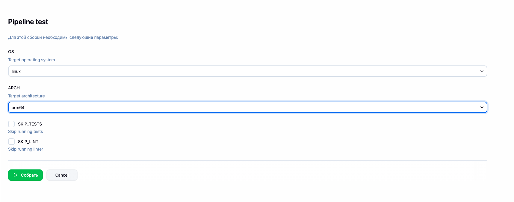
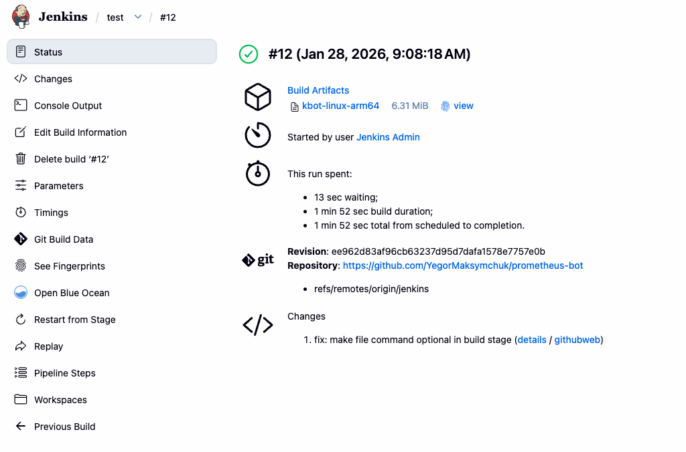

# Jenkins Pipeline Overview

## Introduction

This document provides a comprehensive overview of the Jenkins CI/CD pipeline for the `prometheus-bot` project. The pipeline automates the build, test, and deployment process for the Go-based `kbot` application, supporting multiple operating systems and architectures.

## Pipeline Configuration

### Parameters

The pipeline accepts the following build parameters (configured before each build):

| Parameter | Type | Options | Default | Description |
|-----------|------|---------|---------|-------------|
| **OS** | Choice | `linux`, `darwin`, `windows` | `linux` | Target operating system for the binary |
| **ARCH** | Choice | `amd64`, `arm64` | `amd64` | Target CPU architecture |
| **SKIP_TESTS** | Boolean | `true`, `false` | `false` | Skip running Go tests |
| **SKIP_LINT** | Boolean | `true`, `false` | `false` | Skip running linter checks |

**Example Configuration:**
- OS: `linux`
- ARCH: `arm64`
- SKIP_TESTS: Unchecked
- SKIP_LINT: Unchecked



*Figure 1: Jenkins pipeline parameter configuration interface*

### Environment Variables

The pipeline sets the following environment variables:

| Variable | Value | Description |
|----------|-------|-------------|
| `GO_VERSION` | `1.23.5` | Go SDK version to use |
| `APP_NAME` | `kbot` | Application name |
| `BIN_DIR` | `bin` | Output directory for binaries |
| `PLATFORM` | `${OS}-${ARCH}` | Combined platform identifier (e.g., `linux-amd64`) |
| `BINARY_NAME` | `kbot-${PLATFORM}` | Generated binary filename (`.exe` for Windows) |
| `GOOS` | `${OS}` | Go build target OS |
| `GOARCH` | `${ARCH}` | Go build target architecture |

## Pipeline Stages

### 1. Checkout

**Purpose:** Retrieves the source code from the Git repository.

**Actions:**
- Checks out code from SCM (Source Control Management)
- Captures Git commit hash and branch name
- Stores commit information in environment variables (`GIT_COMMIT`, `GIT_BRANCH`)

**Output:**
```
Git commit: ee962d8
Git branch: jenkins
```

### 2. Setup Go Environment

**Purpose:** Ensures a valid Go SDK is available for building the application.

**Strategy (in order of preference):**
1. **System Go:** Checks if Go is installed system-wide
2. **Jenkins Tool:** Uses Jenkins-configured Go tool if available
3. **Workspace Installation:** Downloads and installs Go to the workspace

**Installation Process:**
- Detects system architecture automatically (`amd64`, `arm64`, etc.)
- Downloads Go archive from `https://go.dev/dl/`
- Verifies download integrity:
  - File size check (> 50MB)
  - Archive validity check (`tar -tzf`)
  - Binary functionality test (`go version`, `go env GOROOT`)
- Cleans up any old/corrupted installations before downloading

**Go Environment Configuration:**
```bash
GOPROXY=https://proxy.golang.org,direct
GOSUMDB=sum.golang.org
GO111MODULE=on
CGO_ENABLED=0
```

**Verification:**
- Displays Go version
- Verifies `GOROOT` and `GOPATH` are set correctly

### 3. Install Dependencies

**Purpose:** Downloads and verifies Go module dependencies.

**Process:**
- Runs `go mod tidy` to ensure `go.mod` is up-to-date
- Downloads modules with retry logic (up to 3 attempts)
- Falls back to direct proxy if default proxy fails
- Verifies module checksums with `go mod verify`

**Error Handling:**
- Retries failed downloads with exponential backoff
- Falls back to direct proxy mode if needed
- Continues even if verification fails (with warning)

### 4. Run Tests

**Purpose:** Executes Go unit tests and generates coverage reports.

**Condition:** Only runs if `SKIP_TESTS` parameter is `false` (default).

**Actions:**
- Runs `go test -v` on all packages (`./...`)
- Generates coverage profile (`coverage.out`)
- Displays coverage summary using `go tool cover`

**Output:**
- Test results with verbose output
- Coverage percentage per package

### 5. Run Linter

**Purpose:** Performs code quality checks using Go's built-in tools.

**Condition:** Only runs if `SKIP_LINT` parameter is `false` (default).

**Actions:**
- Formats code with `go fmt ./...`
- Runs static analysis with `go vet ./...`

**Note:** This stage ensures code consistency and catches common Go programming errors.

### 6. Build Binary

**Purpose:** Compiles the Go application into a platform-specific binary.

**Build Configuration:**
- **Build flags:** `-ldflags="-w -s"` (strip debug info and symbol table)
- **Output:** `${BIN_DIR}/${BINARY_NAME}`
- **Source:** `./cmd/kbot/main.go`

**Verification:**
- Checks if binary file exists
- Displays file size and type
- Exits with error if binary creation fails

**Example Output:**
```
Building with GOOS=linux GOARCH=arm64...
✓ Binary built successfully: bin/kbot-linux-arm64
```

### 7. Archive Artifacts

**Purpose:** Stores the built binary as a Jenkins artifact for download.

**Actions:**
- Archives the binary with fingerprinting enabled
- Displays binary size information
- Makes artifact available for download from Jenkins UI

**Artifact Information:**
- **Name:** `kbot-${PLATFORM}` (or `kbot-${PLATFORM}.exe` for Windows)
- **Location:** `bin/` directory
- **Size:** Varies by platform (typically 5-10 MB)

## Post-Build Actions

### Success

On successful completion, the pipeline displays:
- Build completion message
- Platform information
- Binary location
- Git commit and branch
- Test and linter execution status

### Failure

On failure:
- Displays error message
- Archives coverage report if available (`coverage.out`)
- Provides debugging information in console output

### Always

Regardless of success or failure:
- Logs pipeline completion
- Cleans up workspace directory (`deleteDir()`)

## Build Example

### Successful Build Output

**Build Information:**
- **Build Number:** #12
- **Status:** ✓ Success
- **Duration:** ~1 min 52 sec
- **Platform:** `linux-arm64`
- **Binary:** `kbot-linux-arm64` (6.31 MiB)
- **Git Commit:** `ee962d83af96cb63237d95d7dafa1578e7757e0b`
- **Branch:** `jenkins`



*Figure 2: Jenkins build #12 successful completion status page*

### Build Artifacts

The pipeline produces the following artifacts:
- **Binary:** Platform-specific executable in `bin/` directory
- **Coverage Report:** `coverage.out` (if tests were run)

## Supported Platforms

The pipeline supports building for the following platforms:

| OS | Architecture | Binary Name |
|----|--------------|-------------|
| Linux | amd64 | `kbot-linux-amd64` |
| Linux | arm64 | `kbot-linux-arm64` |
| Darwin (macOS) | amd64 | `kbot-darwin-amd64` |
| Darwin (macOS) | arm64 | `kbot-darwin-arm64` |
| Windows | amd64 | `kbot-windows-amd64.exe` |
| Windows | arm64 | `kbot-windows-arm64.exe` |

## Usage

### Running the Pipeline

1. Navigate to the Jenkins job (`test`)
2. Click **"Build with Parameters"**
3. Select desired parameters:
   - Choose target OS and architecture
   - Optionally skip tests or linting
4. Click **"Build"** (▷ Собрать)

### Accessing Build Artifacts

1. Navigate to the build page (e.g., `#12`)
2. Click on the artifact name in the **"Build Artifacts"** section
3. Download the binary for your target platform

### Viewing Build Logs

1. Open the build page
2. Click **"Console Output"** in the sidebar
3. Review detailed logs for each stage

## Troubleshooting

### Common Issues

#### Go Installation Failures

**Symptoms:** `SIGSEGV: segmentation violation` or `lfstack.push invalid packing`

**Solutions:**
- The pipeline automatically cleans up corrupted installations
- Verify network connectivity to `go.dev/dl`
- Check Jenkins agent has sufficient disk space (> 100MB)

#### Module Download Failures

**Symptoms:** `go mod download` fails

**Solutions:**
- Pipeline automatically retries with fallback proxies
- Check network connectivity to `proxy.golang.org`
- Verify `go.mod` file is valid

#### Build Failures

**Symptoms:** Binary not created or build errors

**Solutions:**
- Check console output for specific Go compilation errors
- Verify source code compiles locally
- Ensure target platform is supported

## Configuration Files

- **Pipeline Definition:** `pipeline/jenkins.groovy`
- **Go Module:** `go.mod` (specifies `go 1.23.5`)
- **Makefile:** `Makefile` (defines `GO_VERSION := 1.23.5`)

## Related Documentation

- [Go Documentation](https://go.dev/doc/)
- [Jenkins Pipeline Documentation](https://www.jenkins.io/doc/book/pipeline/)
- [Project README](../README.md)

## Version History

- **Current Version:** Uses Go 1.23.5
- **Pipeline Version:** Includes robust Go installation with automatic cleanup and verification
- **Last Updated:** January 2026

---

**Note:** This pipeline is designed to be resilient and handle various failure scenarios gracefully, with automatic retries and fallback mechanisms for network operations.
